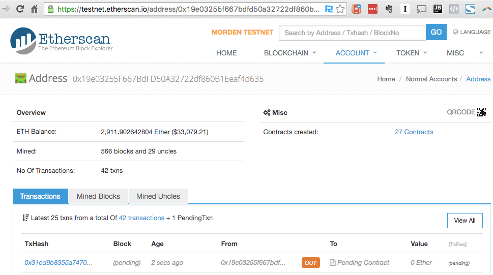

Troubleshooting
===============

Do you have a sample web3j project
----------------------------------

Yes, refer to the web3j sample project outlined in the [Quickstart](quickstart.md).

I'm submitting a transaction, but it's not being mined
--------------------------------------------------------

After creating and sending a transaction, you receive a transaction hash, however calling [eth_getTransactionReceipt](https://github.com/ethereum/wiki/wiki/JSON-RPC#eth_gettransactionreceipt) always returns a blank value, indicating the transaction has not been
mined:

```java
String transactionHash = sendTransaction(...);

// you loop through the following expecting to eventually get a receipt once the transaction
// is mined
EthGetTransactionReceipt.TransactionReceipt transactionReceipt =
        web3j.ethGetTransactionReceipt(transactionHash).sendAsync().get();

if (!transactionReceipt.isPresent()) {
    // try again, ad infinitum
}
```

However, you never receive a transaction receipt. Unfortunately there may not be a an error in your Ethereum client indicating any issues with the transaction:

```java
I1025 18:13:32.817691 eth/api.go:1185] Tx(0xeaac9aab7f9aeab189acd8714c5a60c7424f86820884b815c4448cfcd4d9fc79) to: 0x9c98e381edc5fe1ac514935f3cc3edaa764cf004
```

The easiest way to see if the submission is waiting to mined is to refer to Etherscan and search for the address the transaction was sent using <https://testnet.etherscan.io/address/0x>\... If the submission has been successful it should be visible in Etherscan within seconds of you performing the transaction submission. The wait is for the mining to take place.




If there is no sign of it then the transaction has vanished into the ether (sorry). The likely cause of this is likely to be to do with the transaction's nonce either not being set, or being too low. Please refer to the section [Transaction nonce](transactions.md#the-transaction-nonce) for more information.

I want to see details of the JSON-RPC requests and responses
------------------------------------------------------------

web3j uses the [SLF4J](https://www.slf4j.org/) logging facade, which you can easily integrate with your preferred logging framework. One lightweight approach is to use [LOGBack](https://logback.qos.ch/), which is already configured in the integration-tests module.

Include the LOGBack dependencies listed in [integration-tests/build.gradle](https://github.com/web3j/web3j/blob/master/integration-tests/build.gradle#L7) and associated log configuration as per [integration-tests/src/test/resources/logback-test.xml](https://github.com/web3j/web3j/blob/master/integration-tests/src/test/resources/logback-test.xml).

**Note:** if you are configuring logging for an application (not tests), you will need to ensure that the Logback dependencies are configured as *compile* dependencies, and that the configuration file is named and
located in *src/main/resources/logback.xml*.

I want to obtain some Ether on Testnet, but don't want to have to mine it myself
---------------------------------------------------------------------------------

Please refer to the [Ethereum testnets](transactions.md#ethereum-testnets) for how to obtain some Ether.

How do I obtain the return value from a smart contract method invoked by a transaction?
---------------------------------------------------------------------------------------

You can't. It is not possible to return values from methods on smart contracts that are called as part of a transaction. If you wish to read a value during a transaction, you must use [Events](http://solidity.readthedocs.io/en/develop/contracts.html#events). To query values from smart contracts you must use a call, which is separate to a transaction. These methods should be marked as [constant](http://solidity.readthedocs.io/en/develop/contracts.html?highlight=constant#constant-functions) functions. [Solidity smart contract wrappers](smart_contracts.md#solidity-smart-contract-wrappers) created by web3j handle these differences for you.

The following StackExchange [post](http://ethereum.stackexchange.com/questions/765/what-is-the-difference-between-a-transaction-and-a-call) is useful for background.

Is it possible to send arbitrary text with transactions?
--------------------------------------------------------

Yes it is. Text should be ASCII encoded and provided as a hexadecimal String in the data field of the transaction. This is demonstrated below:

```java
RawTransaction.createTransaction(
        <nonce>, GAS_PRICE, GAS_LIMIT, "0x<address>", <amount>, "0x<hex encoded text>");

byte[] signedMessage = TransactionEncoder.signMessage(rawTransaction, ALICE);
String hexValue = Numeric.toHexString(signedMessage);

EthSendTransaction ethSendTransaction =
        web3j.ethSendRawTransaction(hexValue).send();
String transactionHash = ethSendTransaction.getTransactionHash();
...
```

*Note*: Please ensure you increase the gas limit on the transaction to allow for the storage of text.

The following StackExchange [post](http://ethereum.stackexchange.com/questions/2466/how-do-i-send-an-arbitary-message-to-an-ethereum-address) is useful for background.

I've generated my smart contract wrapper, but the binary for the smart contract is empty?
------------------------------------------------------------------------------------------

If you have defined an interface in Solidity, but one of your method implementations doesn't match the original interface definitions, the produced binary will be blank.

In the following example:

```java
contract Web3jToken is ERC20Basic, Ownable {
    ...
    function transfer(address _from, address _to, uint256 _value) onlyOwner returns (bool) {
    ...
}
```

We forgot to define the *from* parameter in one of the inherited contracts:

```javascript
contract ERC20Basic {
    ...
    function transfer(address to, uint256 value) returns (bool);
    ...
}
```

The Solidity compiler will not complain about this, however, the produced binary file for the Web3jToken will be blank.

My ENS lookups are failing
--------------------------

Are you sure that you are connecting to the correct network to perform the lookup?

If web3j is telling you that the node is not in sync, you may need to change the *syncThreshold* in the
[ENS resolver](ethereum_name_service.md#web3j-implementation).

Do you have a project donation address?
---------------------------------------

Absolutely, you can contribute Bitcoin or Ether to help fund the development of web3j.

---------- --------------------------------------------
  Ethereum   0x2dfBf35bb7c3c0A466A6C48BEBf3eF7576d3C420

  Bitcoin    	1DfUeRWUy4VjekPmmZUNqCjcJBMwsyp61G
---------- --------------------------------------------

Where can I get commercial support for web3j?
---------------------------------------------

Commercial support and training is available from [web3labs](https://www.web3labs.com/).
